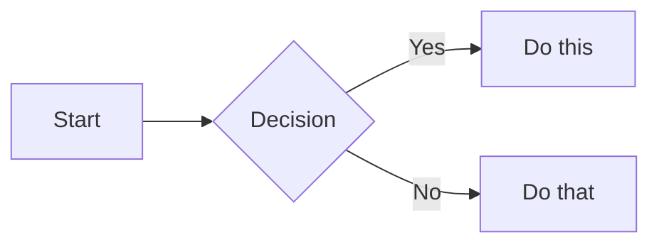

# Slidev — Инструкция по запуску презентации

## Что такое Slidev?

[Slidev](https://sli.dev) — это инструмент для создания презентаций на основе Markdown + Vue. Ты пишешь слайды в `.md` файле, а Slidev превращает их в интерактивный веб-сайт с навигацией, анимациями и hot-reload.

**Ключевые возможности:**

- Markdown-синтаксис для контента слайдов
- Код с подсветкой синтаксиса (Shiki)
- Mermaid-диаграммы прямо в слайдах
- Темы оформления
- Speaker notes
- Экспорт в PDF
- Presenter mode (отдельное окно для докладчика)

---

## Структура файлов

```
rs-tandem/
├── presentation/
│   ├── slides.md           ← основной файл презентации
│   ├── package.json        ← зависимости Slidev
│   ├── package-lock.json
│   └── node_modules/       ← Slidev уже установлен
└── SLIDEV_README.md        ← этот файл
```

> **Slidev уже установлен локально** в `presentation/node_modules/`.
> Просто запускай `npm run dev` из папки `presentation/`.

---

## Запуск

### Требования

- Node.js >= 18
- npm >= 9

### Стартовая команда (Slidev уже установлен)

```bash
# Из корня проекта
cd presentation

# Запустить dev-сервер (откроется браузер автоматически)
npm run dev
```

Slidev будет доступен на `http://localhost:3030`

---

### Установить Slidev заново (если `node_modules` удалили)

Этот способ даёт доступ к установке тем, плагинов и настройке конфигурации.

**Шаг 1: Создать папку под Slidev**

```bash
cd presentation
npm init -y
```

**Шаг 2: Установить Slidev и зависимости**

```bash
npm install --save-dev @slidev/cli @slidev/theme-seriph
```

**Шаг 3: Добавить скрипты в `package.json`**

```json
{
  "scripts": {
    "dev": "slidev slides.md --open",
    "build": "slidev build slides.md",
    "export": "slidev export slides.md"
  }
}
```

**Шаг 4: Запустить**

```bash
npm run dev
```

---

## Как устроен файл `slides.md`

### Разделители слайдов

Три дефиса `---` на отдельной строке разделяют слайды:

```markdown
---
# Слайд 1

Контент первого слайда
---

# Слайд 2

Контент второго слайда
```

### Frontmatter (метаданные)

Первый блок `---` в файле — это frontmatter всей презентации:

```yaml
---
theme: seriph # тема оформления
background: url(...) # фон обложки
class: text-center # CSS-класс для первого слайда
highlighter: shiki # подсветка кода
lineNumbers: false # номера строк в коде
transition: slide-left # переход между слайдами
title: My Presentation # заголовок в браузере
---
```

### Layout-варианты

Каждый слайд может иметь `layout`:

```markdown
---
layout: two-cols # два столбца
---

# Левая колонка

Контент слева

::right::

Контент справа
```

**Встроенные layouts:**

- `default` — обычный слайд
- `center` — контент по центру
- `cover` / `intro` — обложка
- `two-cols` — два столбца
- `image-right` / `image-left` — изображение сбоку
- `quote` — цитата
- `section` — разделитель секций

### Анимации (v-clicks)

```markdown
<v-clicks>

- Первый пункт появляется при клике
- Второй пункт — при следующем клике
- Третий — ещё через клик

</v-clicks>
```

### Mermaid-диаграммы

````markdown

````

### Код с подсветкой

````markdown
```ts {1,3-5}
// Строки 1, 3-5 будут подсвечены
const x = 1;
const y = 2;
const z = x + y;
```
````

---

## Навигация в презентации

| Клавиша       | Действие                          |
| ------------- | --------------------------------- |
| `→` / `Space` | Следующий слайд / анимация        |
| `←`           | Предыдущий слайд                  |
| `f`           | Полноэкранный режим               |
| `d`           | Переключить dark/light            |
| `g`           | Перейти к слайду по номеру        |
| `o`           | Обзор всех слайдов                |
| `p`           | Режим докладчика (Presenter mode) |
| `?`           | Показать все горячие клавиши      |

---

## Экспорт в PDF

Для экспорта нужен установленный Playwright:

```bash
# Установить Playwright (однократно)
npm install --save-dev playwright-chromium

# Экспортировать
npx slidev export slides.md --format pdf --output presentation.pdf
```

Или через npm script:

```bash
npm run export
```

---

## Экспорт в статический сайт

```bash
npx slidev build slides.md --out dist

# Результат: папка dist/ с готовым HTML/JS/CSS
# Можно задеплоить на Netlify/Vercel/GitHub Pages
```

---

## Доступные темы

Список официальных тем: https://sli.dev/themes/gallery

| Тема                                  | Установка                        |
| ------------------------------------- | -------------------------------- |
| `seriph` (используется в презентации) | `npm i @slidev/theme-seriph`     |
| `default`                             | встроенная                       |
| `apple-basic`                         | `npm i slidev-theme-apple-basic` |
| `bricks`                              | `npm i slidev-theme-bricks`      |
| `penguin`                             | `npm i slidev-theme-penguin`     |

Сменить тему — одна строка в frontmatter:

```yaml
---
theme: apple-basic
---
```

---

## Режим докладчика (Presenter Mode)

При запуске `npm run dev` нажми `p` или открой:

```
http://localhost:3030/presenter
```

В режиме докладчика видны:

- Текущий слайд
- Следующий слайд (preview)
- Speaker notes
- Таймер
- Заметки к слайду

Speaker notes добавляются в конце слайда после `---`:

```markdown
# Мой слайд

Контент слайда

<!--
Здесь заметки для докладчика. Видны только в presenter mode.
Можно написать, что хочешь сказать вслух.
-->
```

---

## Добавление скриншотов

Слайд «Приложение в действии» поддерживает реальные скриншоты из приложения.

### Где хранятся скриншоты

```
presentation/
└── public/
    ├── screen-library.png    ← экран выбора темы ✅
    ├── screen-practice.png   ← игровой экран ✅
    └── screen-dashboard.png  ← экран результатов (добавить)
```

Всё, что лежит в `presentation/public/`, доступно в слайдах по пути `/имя-файла.png`.

### Как сделать скриншот

1. Открой живое приложение: `https://webis-2022-rs-tandem.netlify.app/`
2. Сделай скриншот нужного экрана (рекомендуемое разрешение — 1280×800 или шире)
3. Сохрани в `presentation/public/` с правильным именем

### Как вставить скриншот в слайд

```html

```

Классы:

- `h-44` — фиксированная высота (11rem). Меняй по необходимости.
- `object-cover` — заполняет контейнер без искажений
- `object-top` — показывает верхнюю часть скриншота (где самое важное)

### Заменить плейсхолдер на скриншот

В слайде «Приложение в действии» Dashboard-плейсхолдер выглядит так:

```html
<div class="h-44 flex items-center justify-center ...">
  <span>Добавь скриншот:<br />public/screen-dashboard.png</span>
</div>
```

Замени весь `<div class="h-44 ...">...</div>` на:

```html

```

---

## Быстрый старт — TL;DR

Slidev уже установлен — просто:

```bash
# Из корня проекта rs-tandem
cd presentation
npm run dev
# → http://localhost:3030
```

Браузер откроется автоматически. Нажми `p` для Presenter Mode, `o` для обзора всех слайдов.
