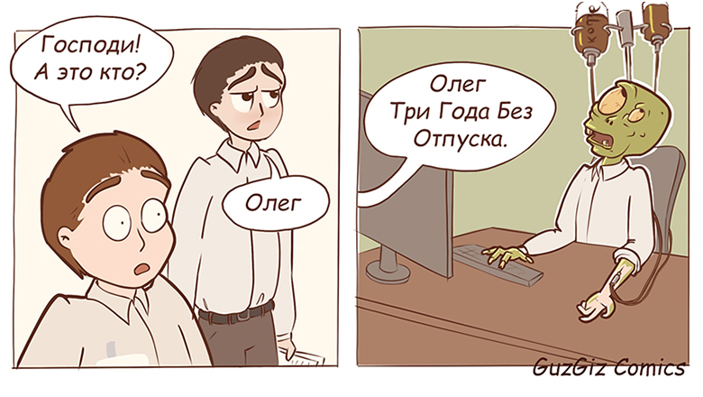

# Дата: 17 февраля 2026 года

Ну здравствуй, дорогой дневник!
Тут говорят, что тебя надо обязательно писать, а то страданий недостаточно =) Значит, будем не успевать писать ещё и тебя))

**Что было сделано:**

- Провели встречу команды, познакомились, придумали кратко что будем делать и распределили предварительно роли. Меня назначили ответственной за бэкенд, и это меня не радует, потому что бэк я и так постоянно пишу =(
- Решили использовать для бэка Supabase. Нашла по нему несколько курсов, посмотрела основные моменты

**Проблемы:**

- пока я не особо представляю что за задача перед нами стоит, вообще не смотрела что такое этот Tandemn и не участвовала в предварительных встречах из-за нехватки времени. Не особо понимаю, что происходит, а уже надо куда-то бежать. Что делать, что делать что делать?"
- курс меня порядком уже замучал, и у меня полное тотальное выгорание. Но деваться некуда... Будет новый опыт работать на полном выгорании.

**Решения (или попытки):**

- нашла все видосы и данные по заданию, чтобы посмотреть завтра
- завела себе бэк-лог в Singularity. Возможно, надо попробовать там таки канбан, но сил моих нет =)

**Мысли / Планы:**

_Убить всех человеков_.(с)

На самом деле особо без мыслей, есть график - мысли не по графику, поэтому их нафиг!

**Затраченное время:** 4 часа

# Дата: 18 февраля 2026 года

**Что было сделано:**

- Досмотрела лекции по Supabase. Не люблю я все эти хрени странные, которые генерят что-то невразумительное. Любви не прибавилось, но поэкспериментируем)
- Посмотрела само задание и часть связанных с ним видео. Хотя бы поняла что делаем - уже бонусы))))

**Проблемы:**

- необходимость писать бэк бесит ещё больше чем раньше)
- постоянно меняющееся и какое-то сумбурное основное задание. Всегда выходит боком такое на практике.

**Решения (или попытки):**

- none

**Мысли / Планы:**

**Затраченное время:** 3 часа

# Дата: 22 февраля 2026 года

В общем с финальной задачкой ситуация получилась интересная)

Во-первых, саму анкету на распределение я заполнила неправильно (причём поняла это только когда второй раз слушала задание, в первый раз проморгала). Надо было там указать другое количество часов и другой уровень - чтобы попасть в более подходящую команду, где другой уровень запросов и другой уровень задачек. И первую встречу, как и вторую мы провели совершенно не так, как нужно было бы - учитывая, что ребята решили писать самый простой расписанный вариант, можно было бы уже код писать неделю как. Самое забавное, что за неделю похожу никто из участников команды не понял саму задачу, даже имея готовый пример))) Это нонсенс!

Во-вторых, странный товарищ, который считает, что сам Дима назначил его тим-лидом, сказал, что я буду писать только бэк на Supabase и никакого фронта. Жаль только что по заданию так нельзя, но его это не волнует - он важнее)))) Ну слава Богу за товарища Шарикова, благодаря его "запретам" (это же надо быть таким оптимистом) вариантов чего написать я себе придумала много, и все они сильно интереснее простого Widget Trainer.

**Что было сделано:**

- Пообщалась с Димой (автором задания) и придумала себе планы Б-В-Г-Д-Е, которые конечно же:
  
- Собрала простенькую базовую страничку из того, что писала раньше, прикрутила к ней роутер. Завтра прикручу SupaBase.

**Проблемы:**

- документация по SupaBase меня бесит. Они походу слишком часто меняют дизайн, даже их документация не всегда ему соответствует. А уж когда читаешь статьи в интернете или смотришь видео... Вообще потом ничего не найдёшь. Пока получается что найти точку входа сложнее, чем что-то настроить))
- из-за очередных атак дронов мне перенесли самолёт, я не попала на общую встречу, а РосКомНадзор опять позабанил все платные VPN-ки, ничего не хочет открываться из запрещёнки. Бесит блин, особенно когда сидишь в аэропорту незапланированные 6 часов и скучаешь.

**Решения (или попытки):**

- придуман план
- сделана основа странички для тестирования API

**Мысли / Планы:**

- наполнить страничку для тестирования API базовым функционалом
- поменять команду (иногда таки думаю)

**Затраченное время:** 4,5 часа

# Дата: 23 февраля 2026 года

**Что было сделано:**

- Доделала базовую версию странички для тестирования API, теперь там можно дергать запросы, связанные с авторизацией пользователя и его параметрами.
- Настроила SupaBase для пользователя и профиля, добавила базовую верификацию. Добавила, а потом убрала JWT-токен - кажется, это слишком сложно для начала.
- Собрала документацию к коду через нейронку
- Собрала МР - [тык](https://github.com/Webis-2022/rs-tandem/pull/9)

**Проблемы:**

- пока нет, работаем

**Решения (или попытки):**

- собрала знатную хреновину для работы с API. TypeScript меня до сих пор изумляет, столько приходится громоздить...

**Мысли / Планы:**

#### Работа с профилями (таблица profiles)

- [ ] Создание сервиса profileService (или методы в authService)
- [ ] Метод getProfile(userId?) — получение профиля текущего пользователя
- [ ] Метод updateProfile(data) — обновление профиля (display_name, avatar_url)
- [ ] Добавить в левую панель поле для avatar URL (хотя кажется это уже перебор - ?)
- [ ] Кнопки "Get Profile", "Update Profile" с соответствующими обработчиками
- [ ] Проверка, что профиль создаётся автоматически (через триггер в БД)

#### Работа с темами (topics) и виджетами (widgets)

- Создать сервисы topicsService и widgetsService
  - [ ] getTopics() — список всех тем
  - [ ] getTopicById(id) — тема по ID
  - [ ] getWidgetsByTopic(topicId) — виджеты по теме
  - [ ] getWidgetById(id) — конкретный виджет

- Добавить в левую панель поля для ввода ID
  - [ ] Кнопки для каждого метода

#### Валидация ответов (submitAnswer)

- [ ] Метод submitAnswer(widgetId, answer) — отправка ответа на сервер (Edge Function или серверная логика)
- [ ] Поле для ввода answer (JSON) или отдельные поля под каждый тип виджета
- [ ] Кнопка "Submit Answer" -
- [ ] Вывод вердикта (isCorrect, explanation, xpEarned)

#### Улучшения интерфейса

- [ ] Группировка кнопок по категориям (авторизация, профили, контент, валидация) с помощью аккордеонов или вкладок
- [ ] Индикатор загрузки в виде спиннера (вместо текста "Loading...")
- [ ] Режим разработчика (показывать страницу только при import.meta.env.DEV)

#### Технические моменты

- [ ] Завести Issues под это всё счастье
- [ ] Заполнить Trello

**Затраченное время:** 5 часов
