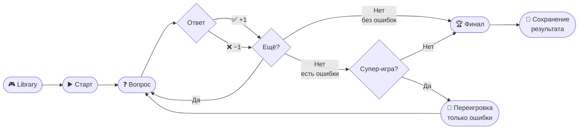

# DOMinator

### HTML & CSS Trainer for Interview Preparation

<div class="pt-12">
  <span class="px-2 py-1 rounded cursor-pointer" hover="bg-white bg-opacity-10">
    Team DevBand · RSS Stage 2 · 2026
  </span>
</div>

<div class="abs-br m-6 flex gap-2">
  <a href="https://webis-2022-rs-tandem.netlify.app/" target="_blank" alt="Live App"
    class="text-xl slidev-icon-btn opacity-50 !border-none !hover:text-white">
    🚀 Live Demo
  </a>
</div>

---

## layout: intro

# Команда DevBand

<div class="grid grid-cols-3 gap-8 mt-8">

<div class="text-center">
  <div class="text-5xl mb-3">👨‍💻</div>
  <div class="font-bold text-xl">Евгений Верёвкин</div>
  <div class="text-sm opacity-70 mt-1">Tech Lead · Архитектура</div>
  <div class="text-xs opacity-50 mt-2">Practice · Dashboard · LLM · Game Logic</div>
</div>

<div class="text-center">
  <div class="text-5xl mb-3">👩‍💻</div>
  <div class="font-bold text-xl">Александра Потапова</div>
  <div class="text-sm opacity-70 mt-1">Frontend · Backend</div>
  <div class="text-xs opacity-50 mt-2">Library · Auth · Active Game · Supabase</div>
</div>

<div class="text-center">
  <div class="text-5xl mb-3">👨‍🎨</div>
  <div class="font-bold text-xl">Сергей Уразов</div>
  <div class="text-sm opacity-70 mt-1">Frontend · UI</div>
  <div class="text-xs opacity-50 mt-2">Modal · Layout · Landing · Auth Service</div>
</div>

</div>

<div class="mt-10 text-center opacity-60">
  <span class="text-sm">Ментор: Иван</span>
  <span class="mx-4">·</span>
  <span class="text-sm">5 командных встреч</span>
  <span class="mx-4">·</span>
  <span class="text-sm">~180 PR за 7 недель</span>
</div>

---

## layout: two-cols

# Что такое DOMinator?

**Тренажёр HTML/CSS** для подготовки к интервью.

<v-clicks>

- 📚 **Библиотека тем** — HTML & CSS топики по уровням сложности
- ❓ **Вопросы с вариантами** — генерируются LLM на лету
- 🎮 **Игровая механика** — очки, штрафы, super-game
- 💡 **Подсказки** — 50/50, звонок другу, объяснение
- 🔄 **Resume flow** — игра сохраняется, можно продолжить
- 🏆 **Ачивки** — Loser / Master / Guru по итогам

</v-clicks>

::right::

<div class="pl-8 mt-4">

```
Пользовательский путь:

Landing
  └── Register / Login
        └── Library (выбор темы)
              └── Practice (игра)
                    ├── Super-Game (если ошибки)
                    └── Final Screen (ачивки)
                          └── Dashboard (история)
```

<div class="mt-6 p-4 bg-blue-50 rounded-lg dark:bg-blue-900">
  <div class="text-sm font-bold">Scoring</div>
  <div class="text-xs mt-1">+1 правильный · -1 неправильный</div>
  <div class="text-xs">Super Game: all or nothing bonus</div>
</div>

</div>

---

layout: center
class: text-center

---

# Проблема и цель

<div class="flex gap-8 mt-10 text-left">

<div class="flex-1 p-7 bg-orange-50 dark:bg-orange-900 rounded-2xl border border-orange-100 dark:border-orange-800">
  <div class="text-4xl mb-4">🎯</div>
  <div class="text-xl font-bold mb-3">Проблема</div>
  <div class="text-base opacity-80 leading-relaxed">
    Разработчики на входе в профессию не знают,
    <strong>как готовиться к техническим интервью</strong> по HTML и CSS.
    Документация есть везде — но нет инструмента для практики
    именно в формате интервью.
  </div>
</div>

<div class="flex-1 p-7 bg-blue-50 dark:bg-blue-900 rounded-2xl border border-blue-100 dark:border-blue-800">
  <div class="text-4xl mb-4">💡</div>
  <div class="text-xl font-bold mb-3">Цель</div>
  <div class="text-base opacity-80 leading-relaxed">
    Создать интерактивный тренажёр с настоящими вопросами,
    уровнями сложности, подсказками и отслеживанием прогресса.
    Чтобы прийти на интервью — и <strong>знать HTML/CSS</strong>.
  </div>
</div>

</div>

---

# Tech Stack

<div class="grid grid-cols-2 gap-8 mt-6">

<div>

### Frontend

<div class="space-y-2 mt-3">
  <div class="flex items-center gap-3 p-2 bg-gray-50 dark:bg-gray-800 rounded">
    <span class="text-2xl">⚡</span>
    <div><div class="font-bold">TypeScript + Vite</div><div class="text-xs opacity-60">строгая типизация, быстрый dev-сервер</div></div>
  </div>
  <div class="flex items-center gap-3 p-2 bg-gray-50 dark:bg-gray-800 rounded">
    <span class="text-2xl">🎨</span>
    <div><div class="font-bold">SCSS + CSS Custom Properties</div><div class="text-xs opacity-60">design tokens, dark/light themes</div></div>
  </div>
  <div class="flex items-center gap-3 p-2 bg-gray-50 dark:bg-gray-800 rounded">
    <span class="text-2xl">🧪</span>
    <div><div class="font-bold">Vitest + @testing-library/dom</div><div class="text-xs opacity-60">123+ тестов, jsdom environment</div></div>
  </div>
  <div class="flex items-center gap-3 p-2 bg-gray-50 dark:bg-gray-800 rounded">
    <span class="text-2xl">🔒</span>
    <div><div class="font-bold">ESLint + Prettier + Husky</div><div class="text-xs opacity-60">GitHub Actions CI</div></div>
  </div>
</div>

</div>

<div>

### Backend / Infra

<div class="space-y-2 mt-3">
  <div class="flex items-center gap-3 p-2 bg-gray-50 dark:bg-gray-800 rounded">
    <span class="text-2xl">🟢</span>
    <div><div class="font-bold">Supabase</div><div class="text-xs opacity-60">Auth · PostgreSQL · Edge Functions · RLS</div></div>
  </div>
  <div class="flex items-center gap-3 p-2 bg-gray-50 dark:bg-gray-800 rounded">
    <span class="text-2xl">🤖</span>
    <div><div class="font-bold">LLM API (Edge Function)</div><div class="text-xs opacity-60">генерация вопросов + кэширование в БД</div></div>
  </div>
  <div class="flex items-center gap-3 p-2 bg-gray-50 dark:bg-gray-800 rounded">
    <span class="text-2xl">🌐</span>
    <div><div class="font-bold">Netlify</div><div class="text-xs opacity-60">деплой продакшн-версии</div></div>
  </div>
  <div class="flex items-center gap-3 p-2 bg-gray-50 dark:bg-gray-800 rounded">
    <span class="text-2xl">📋</span>
    <div><div class="font-bold">Trello</div><div class="text-xs opacity-60">командный трекер задач</div></div>
  </div>
</div>

</div>

</div>

---

# Архитектура приложения

<div class="grid grid-cols-4 gap-3 mt-6 text-sm">

<div class="p-3 bg-indigo-50 dark:bg-indigo-900 rounded-lg">
  <div class="font-bold text-indigo-700 dark:text-indigo-300 mb-2">⚙️ App Core</div>
  <div class="space-y-1 text-xs opacity-80">
    <div>Router + guards</div>
    <div>Global store</div>
    <div>Actions</div>
    <div>Layout</div>
  </div>
</div>

<div class="p-3 bg-blue-50 dark:bg-blue-900 rounded-lg">
  <div class="font-bold text-blue-700 dark:text-blue-300 mb-2">📄 Pages</div>
  <div class="space-y-1 text-xs opacity-80">
    <div>Landing</div>
    <div>Auth</div>
    <div>Library</div>
    <div>Practice</div>
    <div>Dashboard</div>
  </div>
</div>

<div class="p-3 bg-green-50 dark:bg-green-900 rounded-lg">
  <div class="font-bold text-green-700 dark:text-green-300 mb-2">🧩 Components</div>
  <div class="space-y-1 text-xs opacity-80">
    <div>Game logic</div>
    <div>Practice card</div>
    <div>Hints</div>
    <div>Modal</div>
    <div>Final screen</div>
  </div>
</div>

<div class="p-3 bg-orange-50 dark:bg-orange-900 rounded-lg">
  <div class="font-bold text-orange-700 dark:text-orange-300 mb-2">🔌 Services</div>
  <div class="space-y-1 text-xs opacity-80">
    <div>Auth service</div>
    <div>Resume game</div>
    <div>Sync to server</div>
    <div>API layer</div>
  </div>
</div>

</div>

<div class="mt-4 p-3 bg-gray-50 dark:bg-gray-800 rounded-lg text-xs">
  <span class="font-bold">Ключевой принцип:</span> страницы и компоненты не знают о Supabase — всё через сервисный слой.
  Состояние хранится в одном store, обновляется через actions, UI подписывается на изменения.
</div>

---

## layout: two-cols

# Глобальный State

**Один объект — единый источник правды для всего приложения**

<v-clicks>

<div class="mt-4 space-y-3">

<div class="p-3 bg-blue-50 dark:bg-blue-900 rounded-lg text-sm">
  <div class="font-bold">👤 user</div>
  <div class="text-xs opacity-70 mt-1">кто залогинен, токен сессии</div>
</div>

<div class="p-3 bg-green-50 dark:bg-green-900 rounded-lg text-sm">
  <div class="font-bold">🎮 game</div>
  <div class="text-xs opacity-70 mt-1">тема, сложность, очки, раунд, подсказки, ошибки, режим (обычная / супер-игра)</div>
</div>

<div class="p-3 bg-purple-50 dark:bg-purple-900 rounded-lg text-sm">
  <div class="font-bold">🎨 ui</div>
  <div class="text-xs opacity-70 mt-1">тема оформления, текущий маршрут, состояние меню</div>
</div>

</div>

</v-clicks>

::right::

<div class="pl-6 mt-8">

<v-clicks>

**Где это хранится?**

| Данные        | Где живут                                        |
| ------------- | ------------------------------------------------ |
| Пользователь  | `localStorage` + Supabase Auth                   |
| Активная игра | `localStorage` + таблица `active_games`          |
| Настройки UI  | `localStorage` (тема сохраняется между сессиями) |

<div class="mt-4 p-3 bg-yellow-50 dark:bg-yellow-900 rounded-lg text-sm">
  <div class="font-bold">Почему это важно</div>
  <div class="text-xs opacity-80 mt-1">
    Любой компонент — Header, игровая карточка, навигация —
    подписывается на store и получает обновления автоматически.
    Нет prop-drilling, нет рассинхрона.
  </div>
</div>

</v-clicks>

</div>

---

# Router: кто куда может попасть

<div class="grid grid-cols-2 gap-6 mt-6">

<div>

<div class="space-y-2 text-sm">

<div class="p-3 bg-gray-50 dark:bg-gray-800 rounded-lg">
  <div class="font-bold mb-2">🔓 Только для гостей</div>
  <div class="flex justify-between items-center">
    <span class="font-mono text-xs">/</span>
    <span class="text-xs">→ Landing</span>
  </div>
  <div class="flex justify-between items-center mt-1">
    <span class="font-mono text-xs">/login</span>
    <span class="text-xs">→ Auth</span>
  </div>
</div>

<div class="p-3 bg-gray-50 dark:bg-gray-800 rounded-lg">
  <div class="font-bold mb-2">🔐 Только для авторизованных</div>
  <div class="flex justify-between items-center">
    <span class="font-mono text-xs">/library</span>
    <span class="text-xs">→ Library</span>
  </div>
  <div class="flex justify-between items-center mt-1">
    <span class="font-mono text-xs">/practice</span>
    <span class="text-xs">→ Practice</span>
  </div>
  <div class="flex justify-between items-center mt-1">
    <span class="font-mono text-xs">/dashboard</span>
    <span class="text-xs">→ Dashboard</span>
  </div>
</div>

</div>

</div>

<div>

<v-clicks>

**Как работают редиректы**

<div class="space-y-2 text-sm mt-2">
  <div class="p-2 bg-green-50 dark:bg-green-900 rounded flex gap-2">
    <span>👤</span>
    <span>Гость открывает <code>/practice</code> → попадает на <code>/login</code></span>
  </div>
  <div class="p-2 bg-blue-50 dark:bg-blue-900 rounded flex gap-2">
    <span>✅</span>
    <span>Авторизованный открывает <code>/</code> → попадает на <code>/library</code></span>
  </div>
  <div class="p-2 bg-yellow-50 dark:bg-yellow-900 rounded flex gap-2">
    <span>🔍</span>
    <span>Неизвестный адрес → страница 404</span>
  </div>
</div>

<div class="mt-4 p-3 bg-gray-50 dark:bg-gray-800 rounded text-xs opacity-70">
  Написан с нуля на TypeScript без сторонних библиотек.
  При смене маршрута store автоматически обновляется — навигация подсвечивает активный пункт.
</div>

</v-clicks>

</div>

</div>

---

# Модальное окно

<div class="grid grid-cols-2 gap-6 mt-4">

<div>

**Идея**: модалка работает как диалог — вызываешь, ждёшь ответа, продолжаешь.

```ts
// Вызов выглядит как обычный вопрос
const result = await showModal({
  title: 'Продолжить игру?',
  confirmText: 'Продолжить',
  cancelText: 'Начать заново',
});

if (result.confirmed) {
  // пользователь нажал "Продолжить"
}
```

<div class="mt-3 text-xs opacity-60">Никаких коллбэков — линейный читаемый код</div>

</div>

<div class="flex flex-col items-center justify-center h-full">


<div class="mt-3 text-xs opacity-50 text-center">
  Singleton · ESC / клик по фону закрывает · Promise API
</div>

</div>

</div>

---

layout: center
class: text-center

---

# Game Flow



---

# Система подсказок (Hints)

<div class="grid grid-cols-3 gap-6 mt-6">

<div class="p-4 bg-yellow-50 dark:bg-yellow-900 rounded-lg">
  <div class="text-3xl text-center mb-3">🎯</div>
  <div class="font-bold text-center">50/50</div>
  <div class="text-sm mt-2 opacity-80">Убирает два неправильных варианта ответа</div>
  <div class="text-xs mt-3 opacity-60 font-mono">saveUsedHint('fifty')</div>
</div>

<div class="p-4 bg-green-50 dark:bg-green-900 rounded-lg">
  <div class="text-3xl text-center mb-3">📞</div>
  <div class="font-bold text-center">Call a Friend</div>
  <div class="text-sm mt-2 opacity-80">Предлагает вероятный правильный ответ</div>
  <div class="text-xs mt-3 opacity-60 font-mono">saveUsedHint('friend')</div>
</div>

<div class="p-4 bg-blue-50 dark:bg-blue-900 rounded-lg">
  <div class="text-3xl text-center mb-3">📖</div>
  <div class="font-bold text-center">I Don't Know</div>
  <div class="text-sm mt-2 opacity-80">Открывает side-панель с объяснением вопроса</div>
  <div class="text-xs mt-3 opacity-60 font-mono">saveUsedHint('explain')</div>
</div>

</div>

<v-clicks>

<div class="mt-6 p-4 bg-gray-50 dark:bg-gray-800 rounded-lg">

**Persistence подсказок:**

- Использованные хинты хранятся в `state.game.usedHints`
- Синхронизируются в `active_games` таблицу Supabase
- Кнопки дизейблятся через `usedHints[key] > 0`
- При refresh страницы состояние восстанавливается из store **до рендера**

</div>

</v-clicks>

---

# Приложение в действии

<div class="grid grid-cols-3 gap-4 mt-6">

<div class="rounded-xl overflow-hidden border border-gray-200 dark:border-gray-700">
  <div class="bg-gray-200 dark:bg-gray-700 px-3 py-2 text-xs font-bold opacity-60">Library — выбор темы</div>
  
</div>

<div class="rounded-xl overflow-hidden border border-gray-200 dark:border-gray-700">
  <div class="bg-gray-200 dark:bg-gray-700 px-3 py-2 text-xs font-bold opacity-60">Practice — игровой экран</div>
  
</div>

<div class="rounded-xl overflow-hidden border border-gray-200 dark:border-gray-700 bg-gray-50 dark:bg-gray-800">
  <div class="bg-gray-200 dark:bg-gray-700 px-3 py-2 text-xs font-bold opacity-60">Dashboard — результаты</div>
  <div class="h-44 flex items-center justify-center text-gray-400 text-xs flex-col gap-2 p-4 text-center">
    <span class="text-3xl">📊</span>
    <span>Добавь скриншот:<br/><code class="text-xs">public/screen-dashboard.png</code></span>
  </div>
</div>

</div>

<div class="mt-5 text-center">
  <a href="https://webis-2022-rs-tandem.netlify.app/" target="_blank"
     class="inline-flex items-center gap-2 px-5 py-2 rounded-full bg-indigo-600 text-white text-sm font-medium hover:bg-indigo-700">
    🚀 Открыть живую версию
  </a>
</div>

---

# Challenge 1: Вопросы из воздуха

<div class="grid grid-cols-2 gap-6 mt-4">

<div>

**Задача**: откуда берутся вопросы по HTML/CSS?

<div class="space-y-3 mt-4 text-sm">

<div class="p-3 bg-red-50 dark:bg-red-900 rounded-lg">
  <div class="font-bold">❌ Вариант — написать вручную</div>
  <div class="text-xs opacity-70 mt-1">Сотни вопросов по десяткам тем? Нереально.</div>
</div>

<div class="p-3 bg-green-50 dark:bg-green-900 rounded-lg">
  <div class="font-bold">✅ Вариант — попросить LLM</div>
  <div class="text-xs opacity-70 mt-1">
    Supabase Edge Function получает тему и уровень сложности,
    запрашивает у LLM батч вопросов в нужном формате
    и сохраняет их в базу.
    Следующий запрос той же темы — из кэша, мгновенно.
  </div>
</div>

</div>

</div>

<div>

<v-clicks>

**Что было нетривиально:**

<div class="space-y-2 text-sm mt-3">
  <div class="p-2 bg-gray-50 dark:bg-gray-800 rounded">
    🎯 Prompt нужно было отточить, чтобы LLM возвращал строгий JSON с правильным форматом вариантов ответа
  </div>
  <div class="p-2 bg-gray-50 dark:bg-gray-800 rounded">
    📝 Каждый вопрос содержит поле <em>explanation</em> — именно оно показывается в подсказке «I Don't Know»
  </div>
  <div class="p-2 bg-gray-50 dark:bg-gray-800 rounded">
    ⚡ Первый запрос по теме ~1–2 сек. Повторный — из базы, мгновенно
  </div>
</div>

</v-clicks>

</div>

</div>

---

# Организация работы команды

<div class="grid grid-cols-2 gap-6 mt-4">

<div>

<div class="text-sm font-bold opacity-60 mb-3">Как мы строили процесс</div>

<div class="space-y-2 text-sm">

<div class="flex gap-3 items-start p-3 bg-gray-50 dark:bg-gray-800 rounded-lg">
  <span class="text-xl">🗓️</span>
  <div>
    <div class="font-bold">5 регулярных встреч</div>
    <div class="text-xs opacity-70 mt-0.5">Старт → декомпозиция → распределение задач → ревью прогресса → финальный sprint</div>
  </div>
</div>

<div class="flex gap-3 items-start p-3 bg-gray-50 dark:bg-gray-800 rounded-lg">
  <span class="text-xl">📋</span>
  <div>
    <div class="font-bold">Trello для задач</div>
    <div class="text-xs opacity-70 mt-0.5">Backlog → In Progress → Done. Середине проекта навели порядок на доске — всё разъехалось</div>
  </div>
</div>

<div class="flex gap-3 items-start p-3 bg-gray-50 dark:bg-gray-800 rounded-lg">
  <span class="text-xl">🔀</span>
  <div>
    <div class="font-bold">PR-driven разработка</div>
    <div class="text-xs opacity-70 mt-0.5">feature/* → develop → main. Только через pull request, code review обязателен</div>
  </div>
</div>

</div>

</div>

<div>

<v-clicks>

<div class="text-sm font-bold opacity-60 mb-3">Что было сложно</div>

<div class="space-y-2 text-sm">

<div class="p-3 bg-yellow-50 dark:bg-yellow-900 rounded-lg">
  <div class="font-bold">🔗 Зависимые задачи</div>
  <div class="text-xs opacity-70 mt-1">Некоторые фичи было сложно делать параллельно — один блокировал другого. Учились договариваться заранее</div>
</div>

<div class="p-3 bg-red-50 dark:bg-red-900 rounded-lg">
  <div class="font-bold">😤 Устаревший код в develop</div>
  <div class="text-xs opacity-70 mt-1">Однажды участник не обновил ветку перед merge — старый код попал в общую. Дорогостоящая ошибка: пришлось делать rebase</div>
</div>

<div class="p-3 bg-green-50 dark:bg-green-900 rounded-lg">
  <div class="font-bold">✅ Вывод</div>
  <div class="text-xs opacity-70 mt-1"><code>git pull origin develop</code> до начала любой задачи — стало правилом, а не рекомендацией</div>
</div>

</div>

</v-clicks>

</div>

</div>

---

# CI/CD: автоматика от коммита до деплоя

<div class="grid grid-cols-3 gap-5 mt-8">

<div class="p-4 bg-gray-50 dark:bg-gray-800 rounded-xl text-center">
  <div class="text-4xl mb-3">🐶</div>
  <div class="font-bold text-sm mb-2">Pre-commit (Husky)</div>
  <div class="text-xs opacity-70 leading-relaxed">
    При каждом коммите автоматически запускается <strong>lint-staged</strong> —
    проверяет только изменённые файлы. Грязный код не попадёт в историю.
  </div>
</div>

<div class="p-4 bg-gray-50 dark:bg-gray-800 rounded-xl text-center">
  <div class="text-4xl mb-3">⚙️</div>
  <div class="font-bold text-sm mb-2">GitHub Actions (PR)</div>
  <div class="text-xs opacity-70 leading-relaxed">
    При открытии Pull Request запускается pipeline:
    <strong>tsc</strong> (проверка типов) →
    <strong>eslint</strong> →
    <strong>vitest --run</strong>.
    PR нельзя вмержить, пока всё не зелёное.
  </div>
</div>

<div class="p-4 bg-gray-50 dark:bg-gray-800 rounded-xl text-center">
  <div class="text-4xl mb-3">🚀</div>
  <div class="font-bold text-sm mb-2">Netlify (деплой)</div>
  <div class="text-xs opacity-70 leading-relaxed">
    Merge в <strong>main</strong> — Netlify автоматически запускает сборку
    и публикует новую версию приложения.
    Zero-downtime deploy.
  </div>
</div>

</div>

<div class="mt-6 p-4 bg-indigo-50 dark:bg-indigo-900 rounded-xl text-sm text-center">
  <strong>Итого:</strong> от коммита до продакшна — без ручных шагов.
  Если что-то сломалось — узнаешь ещё на этапе PR, а не после деплоя.
</div>

---

# Ключевые технические решения

<div class="grid grid-cols-2 gap-4 mt-6 text-sm">

<div class="p-4 bg-gray-50 dark:bg-gray-800 rounded-xl">
  <div class="font-bold mb-1">🛠️ Vanilla TypeScript, без фреймворка</div>
  <div class="text-xs opacity-70">SPA-роутер, state management, система подписок — всё написано с нуля. Показывает понимание основ, а не умение настраивать React.</div>
</div>

<div class="p-4 bg-gray-50 dark:bg-gray-800 rounded-xl">
  <div class="font-bold mb-1">🟢 Supabase как единая платформа</div>
  <div class="text-xs opacity-70">Auth, PostgreSQL, Edge Functions и хранилище — в одном сервисе. Для команды без выделенного бекенда это позволило сфокусироваться на продукте.</div>
</div>

<div class="p-4 bg-gray-50 dark:bg-gray-800 rounded-xl">
  <div class="font-bold mb-1">🤖 LLM для генерации контента</div>
  <div class="text-xs opacity-70">Вместо сотен вопросов вручную — Edge Function запрашивает LLM, сохраняет батч в БД. Повторный запрос — из кэша мгновенно. Контент масштабируется.</div>
</div>

<div class="p-4 bg-gray-50 dark:bg-gray-800 rounded-xl">
  <div class="font-bold mb-1">🪟 Promise-based модальное окно</div>
  <div class="text-xs opacity-70"><code>await showModal(...)</code> — любой диалог превращается в линейный код. Не нужно передавать колбэки через несколько уровней.</div>
</div>

<div class="p-4 bg-gray-50 dark:bg-gray-800 rounded-xl">
  <div class="font-bold mb-1">🔄 Тройной источник восстановления</div>
  <div class="text-xs opacity-70">Незавершённая игра ищется: в памяти → localStorage → Supabase. Пользователь никогда не теряет прогресс, даже при перезагрузке браузера.</div>
</div>

<div class="p-4 bg-gray-50 dark:bg-gray-800 rounded-xl">
  <div class="font-bold mb-1">🌓 Runtime смена темы</div>
  <div class="text-xs opacity-70"><code>data-theme</code> на <code>&lt;html&gt;</code> + CSS custom properties. Light/dark переключается без перезагрузки страницы, выбор сохраняется в localStorage.</div>
</div>

</div>

---

# Технические сложности

<div class="grid grid-cols-2 gap-4 mt-5 text-sm">

<div class="p-3 bg-gray-50 dark:bg-gray-800 rounded-xl">
  <div class="flex gap-2 items-start">
    <span class="text-lg">🔐</span>
    <div>
      <div class="font-bold">Supabase RLS и upsert</div>
      <div class="text-xs opacity-70 mt-1">Создавать запись можно, обновить — нельзя. Оказалось, что upsert требует отдельных политик на INSERT и UPDATE. Заняло несколько часов отладки.</div>
    </div>
  </div>
</div>

<div class="p-3 bg-gray-50 dark:bg-gray-800 rounded-xl">
  <div class="flex gap-2 items-start">
    <span class="text-lg">⚡</span>
    <div>
      <div class="font-bold">Игра завершалась дважды</div>
      <div class="text-xs opacity-70 mt-1">Финальная логика сохранения срабатывала из двух мест одновременно. Починили явным await и единственной точкой ответственности.</div>
    </div>
  </div>
</div>

<div class="p-3 bg-gray-50 dark:bg-gray-800 rounded-xl">
  <div class="flex gap-2 items-start">
    <span class="text-lg">🕐</span>
    <div>
      <div class="font-bold">Навигация до инициализации</div>
      <div class="text-xs opacity-70 mt-1">При обновлении страницы приложение пыталось перейти куда-то ещё, хотя роутер ещё не был готов. Решили строгим порядком запуска.</div>
    </div>
  </div>
</div>

<div class="p-3 bg-gray-50 dark:bg-gray-800 rounded-xl">
  <div class="flex gap-2 items-start">
    <span class="text-lg">👻</span>
    <div>
      <div class="font-bold">Объяснение на чужой странице</div>
      <div class="text-xs opacity-70 mt-1">Пока сервер отвечал (~2 сек), пользователь уходил на другую страницу — панель открывалась там. Добавили проверку: DOM-элемент ещё в документе?</div>
    </div>
  </div>
</div>

</div>

<div class="mt-4 p-3 bg-blue-50 dark:bg-blue-900 rounded-xl text-xs text-center">
  Общий урок: асинхронный код без явного порядка и проверки контекста ведёт к непредсказуемым сайд-эффектам. Дисциплина <strong>await</strong> и проверки состояния обязательны.
</div>

---

# Тестирование

<div class="grid grid-cols-2 gap-6 mt-4">

<div>

**12 тест-файлов · 123+ тестов**

| Что покрыто                |     |
| -------------------------- | --- |
| Глобальный store и actions | ✅  |
| Модальное окно             | ✅  |
| Layout и навигация         | ✅  |
| Landing (guest/authed CTA) | ✅  |
| Library + resume flow      | ✅  |
| Авторизация                | ✅  |
| Practice card и подсказки  | ✅  |
| Dashboard                  | ✅  |

</div>

<div class="space-y-3 text-sm mt-1">

<div class="p-3 bg-gray-50 dark:bg-gray-800 rounded-lg">
  <div class="font-bold">🗄️ localStorage в тестах не работает «как в браузере»</div>
  <div class="text-xs opacity-70 mt-1">В Vitest 4.x + jsdom он недоступен при инициализации модулей. Решение — мокировать сервис хранилища, а не сам API.</div>
</div>

<div class="p-3 bg-gray-50 dark:bg-gray-800 rounded-lg">
  <div class="font-bold">🟢 Supabase в тестах не вызывается</div>
  <div class="text-xs opacity-70 mt-1">Тестируется логика приложения, а не доступность внешнего сервиса. Supabase подменяется моком на уровне api-слоя.</div>
</div>

<div class="p-3 bg-indigo-50 dark:bg-indigo-900 rounded-lg">
  <div class="font-bold">⚙️ CI проверяет каждый PR</div>
  <div class="text-xs opacity-70 mt-1">GitHub Actions запускает <code>tsc</code> + <code>eslint</code> + <code>vitest --run</code>. Ни одна регрессия не уходит в develop незамеченной.</div>
</div>

</div>

</div>

---

# Система ачивок

<div class="grid grid-cols-3 gap-8 mt-8">

<div class="text-center p-6 bg-red-50 dark:bg-red-900 rounded-xl">
  <div class="text-6xl mb-4">😔</div>
  <div class="text-2xl font-bold">Loser</div>
  <div class="text-sm mt-2 opacity-70">Score ≤ 50%</div>
  <div class="text-xs mt-3 opacity-60">Недостаточные знания. Рекомендуется больше практики</div>
</div>

<div class="text-center p-6 bg-yellow-50 dark:bg-yellow-900 rounded-xl">
  <div class="text-6xl mb-4">⚔️</div>
  <div class="text-2xl font-bold">Master</div>
  <div class="text-sm mt-2 opacity-70">Score 51–85%</div>
  <div class="text-xs mt-3 opacity-60">Уверенное знание с пространством для роста</div>
</div>

<div class="text-center p-6 bg-green-50 dark:bg-green-900 rounded-xl">
  <div class="text-6xl mb-4">🧘</div>
  <div class="text-2xl font-bold">Guru</div>
  <div class="text-sm mt-2 opacity-70">Score 86–100%</div>
  <div class="text-xs mt-3 opacity-60">Отличные знания и готовность к интервью</div>
</div>

</div>

<div class="mt-8 text-center opacity-70 text-sm">
  Ачивка отображается на final screen и <strong>сохраняется в Supabase</strong> — видна в истории игр на Dashboard
</div>

---

# Сильные стороны проекта

<div class="grid grid-cols-3 gap-4 mt-6 text-sm">

<div class="p-4 bg-indigo-50 dark:bg-indigo-900 rounded-xl">
  <div class="text-2xl mb-2">🛠️</div>
  <div class="font-bold">Без фреймворка</div>
  <div class="text-xs opacity-70 mt-2">Router, state, lifecycle — всё написано вручную на TypeScript. Понимание основ, а не магия фреймворка.</div>
</div>

<div class="p-4 bg-green-50 dark:bg-green-900 rounded-xl">
  <div class="text-2xl mb-2">🤖</div>
  <div class="font-bold">LLM-интеграция</div>
  <div class="text-xs opacity-70 mt-2">Вопросы генерируются автоматически, кэшируются в БД. Контент масштабируется без ручного труда.</div>
</div>

<div class="p-4 bg-blue-50 dark:bg-blue-900 rounded-xl">
  <div class="text-2xl mb-2">🔄</div>
  <div class="font-bold">Устойчивость к сбоям</div>
  <div class="text-xs opacity-70 mt-2">Игра восстанавливается из 3 источников. Обновил страницу, закрыл вкладку — прогресс не теряется.</div>
</div>

<div class="p-4 bg-yellow-50 dark:bg-yellow-900 rounded-xl">
  <div class="text-2xl mb-2">♿</div>
  <div class="font-bold">Доступность (a11y)</div>
  <div class="text-xs opacity-70 mt-2">Skip-link, aria-current, aria-pressed, keyboard navigation. Не как галочка, а как часть архитектуры.</div>
</div>

<div class="p-4 bg-orange-50 dark:bg-orange-900 rounded-xl">
  <div class="text-2xl mb-2">🧪</div>
  <div class="font-bold">123+ тестов</div>
  <div class="text-xs opacity-70 mt-2">Каждый ключевой модуль покрыт. CI не пропустит регрессию в следующий релиз.</div>
</div>

<div class="p-4 bg-purple-50 dark:bg-purple-900 rounded-xl">
  <div class="text-2xl mb-2">👁️</div>
  <div class="font-bold">Code review культура</div>
  <div class="text-xs opacity-70 mt-2">Ни одна задача не мержилась без ревью. Это улучшало архитектуру и передавало контекст всей команде.</div>
</div>

</div>

---

# Что получилось

<div class="grid grid-cols-2 gap-6 mt-4">

<div>

<div class="text-sm font-bold opacity-60 mb-3">Продукт</div>

<div class="space-y-2 text-sm">
  <div class="flex gap-2 items-center p-2 bg-gray-50 dark:bg-gray-800 rounded">✅ Авторизация с сохранением сессии</div>
  <div class="flex gap-2 items-center p-2 bg-gray-50 dark:bg-gray-800 rounded">✅ Библиотека тем с уровнями сложности</div>
  <div class="flex gap-2 items-center p-2 bg-gray-50 dark:bg-gray-800 rounded">✅ Игровой экран с подсказками</div>
  <div class="flex gap-2 items-center p-2 bg-gray-50 dark:bg-gray-800 rounded">✅ Супер-игра для проработки ошибок</div>
  <div class="flex gap-2 items-center p-2 bg-gray-50 dark:bg-gray-800 rounded">✅ Восстановление незавершённых игр</div>
  <div class="flex gap-2 items-center p-2 bg-gray-50 dark:bg-gray-800 rounded">✅ Dashboard с историей и ачивками</div>
  <div class="flex gap-2 items-center p-2 bg-gray-50 dark:bg-gray-800 rounded">✅ Адаптив + dark/light тема</div>
</div>

</div>

<div>

<div class="text-sm font-bold opacity-60 mb-3">Команда</div>

<div class="space-y-3 text-sm">

<div class="p-3 bg-blue-50 dark:bg-blue-900 rounded-xl">
  <div class="font-bold">Первый опыт с Supabase</div>
  <div class="text-xs opacity-70 mt-1">Auth, БД, Edge Functions, RLS — всё освоено в боевых условиях, не в туториале</div>
</div>

<div class="p-3 bg-green-50 dark:bg-green-900 rounded-xl">
  <div class="font-bold">Первый опыт с LLM в продакшне</div>
  <div class="text-xs opacity-70 mt-1">Prompt engineering, обработка JSON-ответов, кэширование — реальная интеграция AI в приложение</div>
</div>

<div class="p-3 bg-purple-50 dark:bg-purple-900 rounded-xl">
  <div class="font-bold">Командная разработка от 0</div>
  <div class="text-xs opacity-70 mt-1">Git workflow, code review, зависимые задачи, конфликты — всё из реальной командной работы</div>
</div>

</div>

</div>

</div>

---

# Выводы

<div class="grid grid-cols-2 gap-3 mt-5 text-sm">

<div class="p-3 bg-blue-50 dark:bg-blue-900 rounded-xl">
  <div class="font-bold">🧭 Планирование спасает время</div>
  <div class="text-xs opacity-70 mt-1">Задачи с зависимостями нужно выявлять до начала спринта, а не в середине — иначе один блокирует другого.</div>
</div>

<div class="p-3 bg-green-50 dark:bg-green-900 rounded-xl">
  <div class="font-bold">🔁 Итерации лучше идеального плана</div>
  <div class="text-xs opacity-70 mt-1">Первая реализация resume flow была заменена трижды. Каждая итерация опиралась на опыт предыдущей.</div>
</div>

<div class="p-3 bg-yellow-50 dark:bg-yellow-900 rounded-xl">
  <div class="font-bold">📖 Документация — это артефакт команды</div>
  <div class="text-xs opacity-70 mt-1">Дневники, meeting notes и CONTEXT_GLOBAL.md сэкономили часы при ревью и онбординге на новые задачи.</div>
</div>

<div class="p-3 bg-orange-50 dark:bg-orange-900 rounded-xl">
  <div class="font-bold">🤝 Code review — это обучение</div>
  <div class="text-xs opacity-70 mt-1">Ревью не формальность. Именно там передавался контекст, находились баги и вырабатывались общие конвенции.</div>
</div>

<div class="p-3 bg-purple-50 dark:bg-purple-900 rounded-xl">
  <div class="font-bold">⚡ Async без дисциплины = хаос</div>
  <div class="text-xs opacity-70 mt-1">Большинство наших сложных багов — это потерянный await или нарушенный порядок инициализации. Правила помогают.</div>
</div>

<div class="p-3 bg-red-50 dark:bg-red-900 rounded-xl">
  <div class="font-bold">🌿 Git — командный инструмент</div>
  <div class="text-xs opacity-70 mt-1">Один несинхронизированный merge стоил команде нескольких часов. Договорённости важнее, чем скорость.</div>
</div>

</div>

---

# Итого

<div class="grid grid-cols-4 gap-6 mt-8 text-center">

<div class="p-4 bg-blue-50 dark:bg-blue-900 rounded-xl">
  <div class="text-4xl font-bold text-blue-600">7</div>
  <div class="text-sm mt-1 opacity-70">недель разработки</div>
</div>

<div class="p-4 bg-green-50 dark:bg-green-900 rounded-xl">
  <div class="text-4xl font-bold text-green-600">180+</div>
  <div class="text-sm mt-1 opacity-70">pull requests</div>
</div>

<div class="p-4 bg-yellow-50 dark:bg-yellow-900 rounded-xl">
  <div class="text-4xl font-bold text-yellow-600">123+</div>
  <div class="text-sm mt-1 opacity-70">unit тестов</div>
</div>

<div class="p-4 bg-purple-50 dark:bg-purple-900 rounded-xl">
  <div class="text-4xl font-bold text-purple-600">∞</div>
  <div class="text-sm mt-1 opacity-70">вопросов от LLM</div>
</div>

</div>

<div class="mt-10 text-xl">

🚀 **[webis-2022-rs-tandem.netlify.app](https://webis-2022-rs-tandem.netlify.app/)**

</div>

<div class="mt-4 opacity-60 text-sm">

[GitHub](https://github.com/Webis-2022/rs-tandem) · RSS Stage 2 · Team DevBand · 2026

</div>
